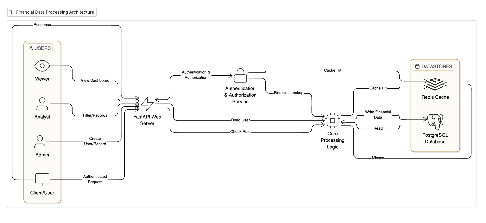

# Finance Data Processing and Access Control Backend

## Overview
This repository contains the backend implementation for a Finance Dashboard System, developed as part of the Zorvyn FinTech Pvt. Ltd. Backend Developer Internship assessment. 

# Architecture


The system is built using **FastAPI, PostgreSQL, and Redis**, focusing heavily on clean architecture, performance optimization, and robust security. It features Role-Based Access Control (RBAC), multi-tiered caching strategies, idempotent API endpoints, and a strictly separated service-repository architectural pattern.

## Architecture and Tech Stack
* **Framework:** FastAPI (Python 3.10+)
* **Database:** PostgreSQL (Relational Data Persistence)
* **Cache & Session Management:** Redis
* **ORM:** SQLAlchemy 2.0
* **Data Validation:** Pydantic
* **Authentication:** JWT (JSON Web Tokens)
* **Containerization:** Docker & Docker Compose

## Advanced System Features

### 1. Robust Role-Based Access Control (RBAC)
Implemented a custom dependency injection pipeline for authentication and authorization.
* **Roles:** Admin, Analyst, Viewer.
* **Cache-First Authorization:** User roles are cached in Redis upon login. The `role_required` dependency checks Redis `sismember` before hitting the database, reducing latency on protected routes.
* **Session Invalidation:** State-aware JWTs using Redis. Logging out or changing roles immediately invalidates the token, preventing unauthorized access using unexpired JWTs.

### 2. High-Performance Caching Strategy
* **Endpoint Caching:** `GET` requests for single records and paginated lists are cached in Redis.
* **Targeted Invalidation:** Mutating operations (`POST`, `PATCH`, `DELETE`) automatically trigger specific cache invalidation protocols to ensure data consistency without flushing the entire cache.
* **Dashboard Aggregations:** Summary statistics are cached per user and globally, updated incrementally where appropriate (e.g., `redis_client.incr("analytics:total_transactions")`).

### 3. API Idempotency
* Financial transactions must not be duplicated. The `POST /api/records/` endpoint requires an `X-Request-ID` header. 
* Redis processes this key using the `NX` (Not Exists) flag with a 60-second TTL. If a client retries a request due to a network timeout, the application explicitly blocks the duplicate execution.

### 4. Centralized Exception Handling
* Removed clutter from business logic by implementing global exception handlers at the FastAPI application level.
* Database-level constraints (like `IntegrityError` for duplicate emails) are caught globally and transformed into sanitized HTTP 400 responses, preventing internal server details from leaking to the client.

### 5. Dependency Injection & Clean Architecture
* Strict separation of concerns: Routers -> Services -> Repositories -> Models.
* FastAPI's dependency injection is utilized to instantiate services and database sessions per request, ensuring thread safety and simplifying future unit testing (mocking).

---

## Local Setup and Installation

### Prerequisites
* Docker and Docker Compose
* Python 3.10+ (If running locally without Docker)


### 1. Running via Docker Compose (Recommended)
This will spin up the FastAPI application, PostgreSQL database, and Redis cache in interconnected containers.

```bash
# Build and start the containers
docker-compose up --build -d

# Check the logs to ensure successful startup
docker-compose logs -f app
```
The application will be available at: `http://localhost:8000`
Interactive API Documentation (Swagger UI): `http://localhost:8000/docs`

### 2. Running Locally (Without Docker)
If you prefer to run the application on your host machine (requires local instances of PostgreSQL and Redis running):

```bash
# Create and activate virtual environment
python -m venv venv
source venv/bin/activate  # On Windows: venv\Scripts\activate

# Install dependencies
pip install -r requirements.txt

# Update .env to point to local hosts
# POSTGRES_HOST=localhost
# REDIS_HOST=localhost

# Run database migrations (if using Alembic)
alembic upgrade head

# Start the application
uvicorn app.main:app --host 0.0.0.0 --port 8000 --reload
```

---
## ⚠️ Important Authentication Note
Most endpoints are protected.

Default Admin Credentials:

Username: `admin@finance.com`
Password: `admin@123`

## Core API Endpoints

### Authentication
* `POST /api/auth/register` - Register a new user
* `POST /api/auth/login` - Authenticate and receive JWT token
* `POST /api/auth/logout` - Invalidate current session in Redis

### Financial Records
* `POST /api/records/` - Create a new record (Requires `X-Request-ID` header. Roles: Admin)
* `GET /api/records/` - Retrieve paginated filter based records (Roles: Admin, Analyst)
* `GET /api/records/{record_id}` - Retrieve specific record (Roles: Admin, Analyst)
* `PATCH /api/records/{record_id}` - Update a record (Role: Admin)
* `DELETE /api/records/{record_id}` - Delete a record (Role: Admin)

### Dashboard Metrics
* `GET /api/dashboard/summary` - Get aggregated financial metrics (Cached)

---

## Design Decisions and Trade-offs

1.  **Offset Pagination vs. Cursor Pagination:** For this implementation, `skip` and `limit` (offset pagination) were utilized for simplicity. For a production system dealing with millions of financial records, this would be swapped to keyset/cursor pagination using `id > last_seen_id` to prevent performance degradation on deep queries.
2.  **Hard Deletes vs. Soft Deletes:** The current implementation uses hard deletes for simplicity. In a real-world financial application, records would utilize soft deletes (an `is_deleted` boolean or `deleted_at` timestamp) to maintain audit trails.
3.  **Redis Cache Coherency:** Cache invalidation logic is tightly coupled within the Service layer. While effective, a future iteration could decouple this using an event-driven architecture (e.g., publishing invalidation events to a message broker).
